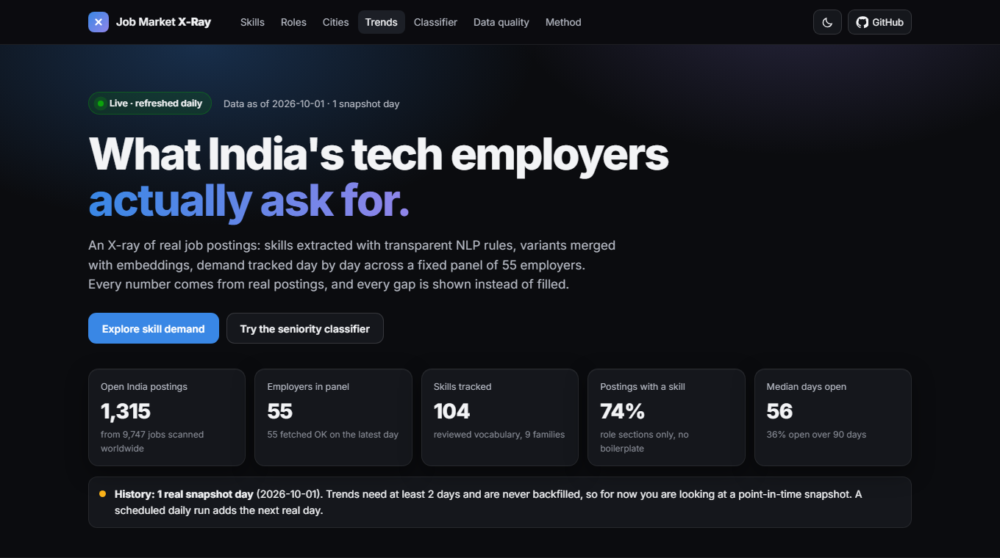
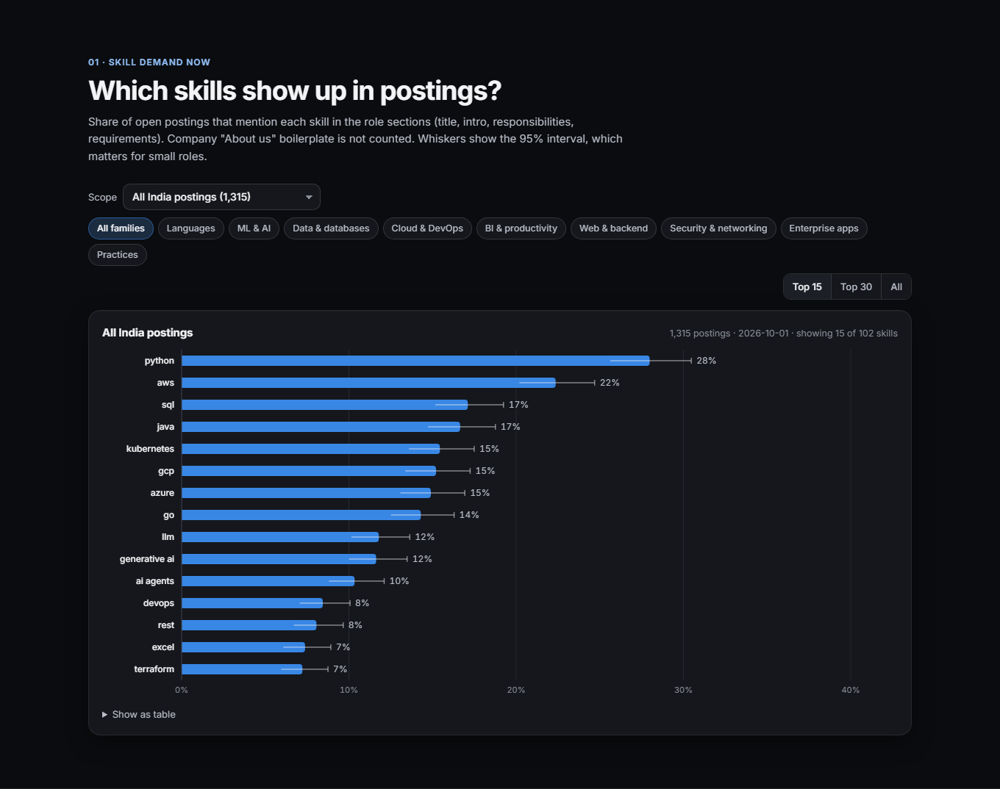
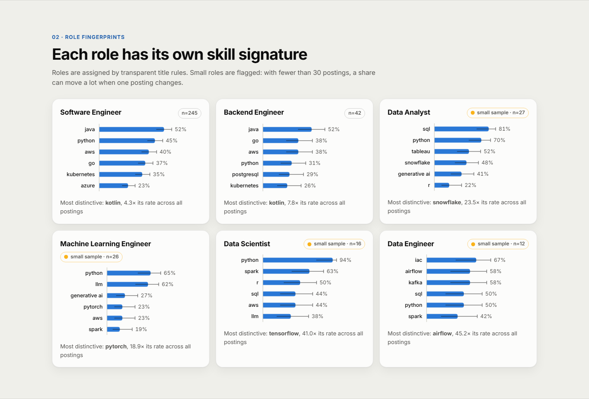
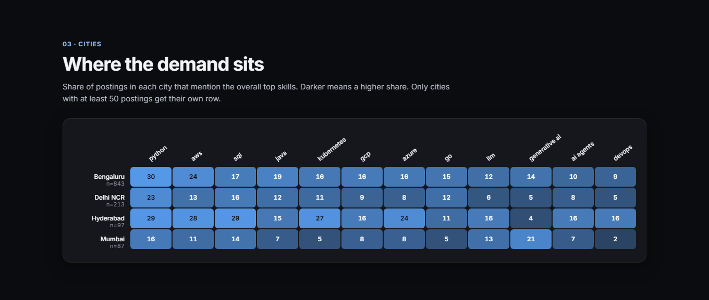
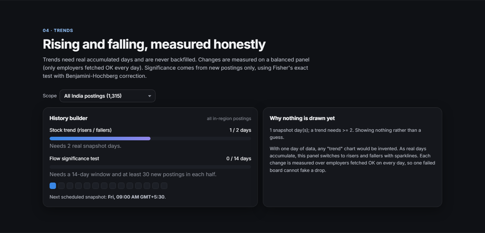
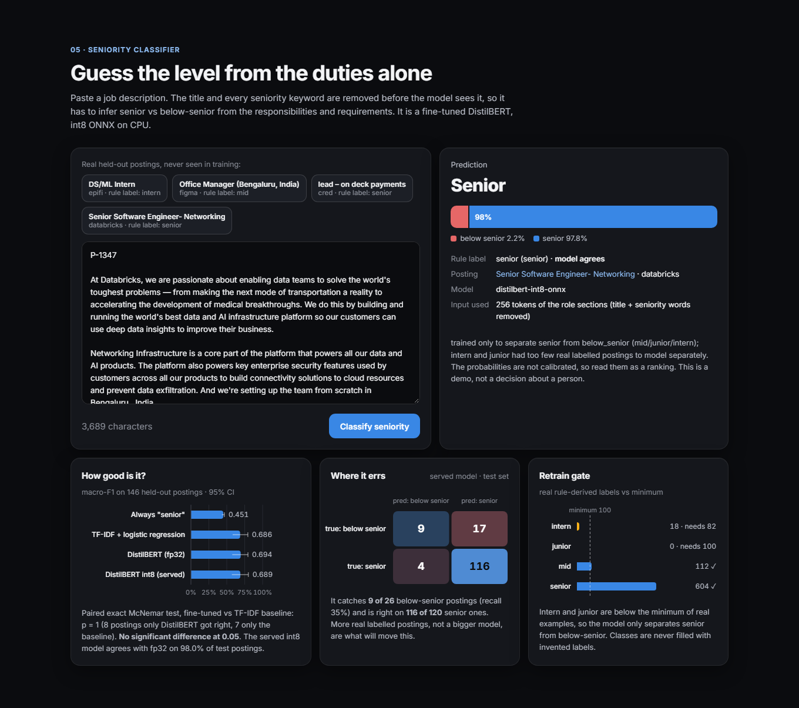
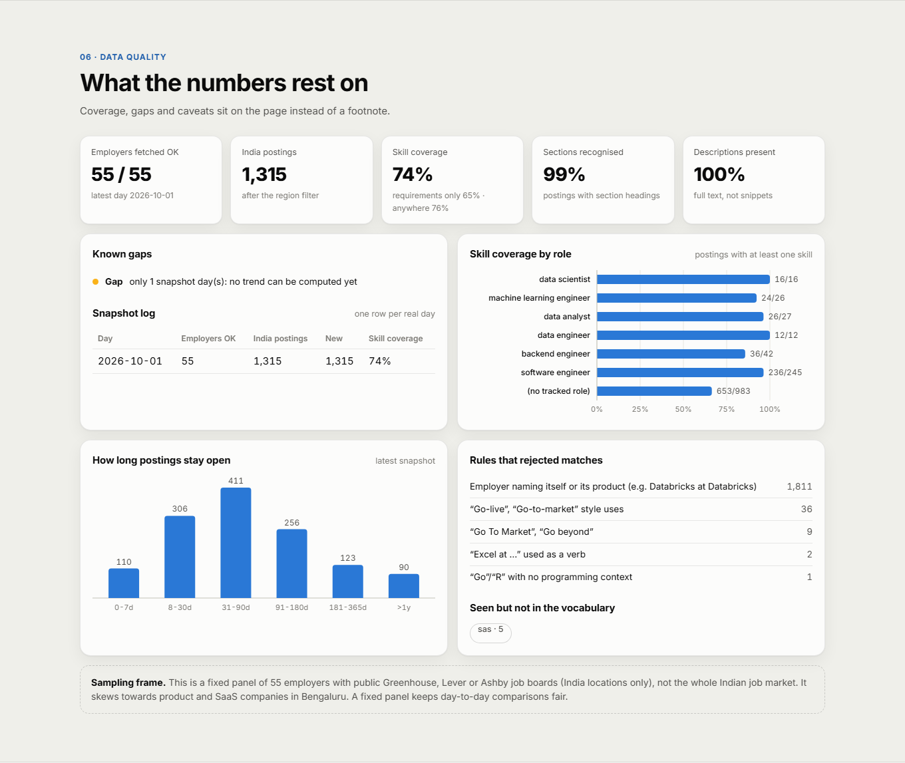
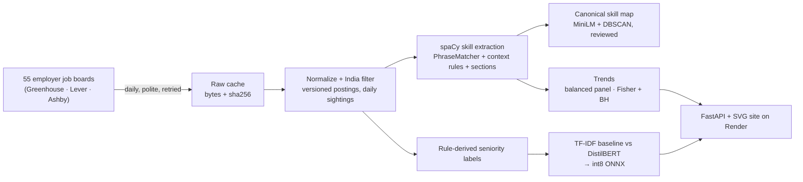

<div align="center">

# Job Market X-Ray

**What India's tech employers actually ask for, measured from real job postings, every day.**

[](https://job-market-xray.onrender.com)
<br>
[](https://github.com/shreyasinha1502/job-market-xray/actions/workflows/ci.yml)
[](https://github.com/shreyasinha1502/job-market-xray/actions/workflows/daily.yml)




</div>

Job Market X-Ray treats live job postings as an economic signal. It pulls real postings from the
public job boards of a fixed panel of 55 employers. It extracts skills with transparent NLP rules,
merges spelling variants with embeddings, and tracks which skills rise or fall per role and per
city. A fine-tuned transformer guesses a posting's seniority from its duties alone. Everything
runs on a free-tier stack: GitHub Actions fetches a new real day each morning, and a Render web
service serves the site.

> **The one rule:** no synthetic data, ever. No mocked postings, no invented labels, no backfilled
> history. When something is missing, the site says so instead of filling it.

## At a glance (snapshot 2026-10-01)

| | |
|---|---|
| Jobs scanned on the panel's boards | **9,747** (all countries) |
| Open India postings | **1,315** from **55** employers |
| Skills tracked | **104** reviewed skills in 9 families |
| Postings with ≥ 1 skill (role sections only) | **73.8%** (tech roles 86–100%) |
| Skill-match precision (manual spot checks) | **39/40** seed vocabulary · **40/40** added vocabulary |
| Median age of an open posting | **56 days** (36% open > 90 days) |
| Seniority classifier, held-out macro-F1 | **0.689** int8 served (DistilBERT 0.694 · TF-IDF 0.686 · majority 0.451) |
| Trend history | grows by one real day every morning, never backfilled |

## What's on the site

<table>
<tr>
<td width="50%"><b>Skill demand now</b><br>Share of postings per skill with 95% Wilson intervals. Filter by role, city or skill family; hover for counts, employers and how often it is a hard requirement.<br></td>
<td width="50%"><b>Role fingerprints</b><br>Top skills per role, small samples flagged, plus each role's most distinctive skill (e.g. Snowflake for data analysts, 23.5× the overall rate).<br></td>
</tr>
<tr>
<td><b>City heatmap</b><br>Bengaluru, Delhi NCR, Hyderabad and Mumbai against the top skills. Every cell carries its own interval.<br></td>
<td><b>Honest trends</b><br>With fewer than 2 real days the panel builds history instead of drawing a fake line. After that it shows risers and fallers on a balanced panel, with a significance test on new postings only.<br></td>
</tr>
<tr>
<td><b>Seniority classifier</b><br>Paste a JD, or try real held-out postings with their true rule label shown. The site displays "model disagrees" when it is wrong.<br></td>
<td><b>Data quality, on the page</b><br>Failed boards, missing days, coverage by role, posting age, rejected matches and vocabulary gaps.<br></td>
</tr>
</table>

## How it works



1. **Ingest.** The public job-board APIs of 55 employers (no keys needed) are fetched with
   throttling and retry/backoff. Every response is cached byte for byte with its sha256 before
   anything parses it. Each stored posting keeps provenance back to that file.
2. **Filter and store.** A posting counts as India only if a structured country field or a
   location string says so, and the matching evidence is stored with it. Postings are versioned
   by content hash, and each day records which postings were open (sightings). Storage is small
   day-partitioned parquet, committed to git.
3. **Extract skills.** spaCy PhraseMatcher runs over a reviewed vocabulary.
   - Exact-spelling rules catch words that are also ordinary English: "Spark" counts, but "a spark
     of inspiration" does not.
   - Context rules handle "Go" and "R": "Go-live", "Go To Market" and "R+E" are rejected.
   - Verb uses are rejected ("Excel at tracking…").
   - Employers naming themselves or their own product are flagged ("Databricks" at Databricks,
     "Elasticsearch" at Elastic).
   - Section tagging keeps "About us" boilerplate out of the counts.
4. **Normalize.** Candidate terms (NER, tech-shaped tokens, list items) are embedded with MiniLM
   (pinned revision) and clustered with DBSCAN. A merge is auto-accepted only when the spelling
   agrees too. Everything else goes to a [reviewed skill map](config/skill_map.yaml) with a
   readable [cluster dump](data/processed/skill_map/clusters_2026-10-01.md).
5. **Trends.** The stock view is the share of open postings over employers fetched OK every day,
   so a failed board can't fake a drop. The flow test applies Fisher's exact test and
   Benjamini-Hochberg to postings first seen in the early vs late half of the window. Every output
   states its real history window.
6. **Classify.** Seniority labels are derived by rule from each posting's title and stated
   experience range. A TF-IDF baseline and DistilBERT are trained on the same splits. The model is
   exported to int8 ONNX so it fits a 512 MB server.

## The honesty contract

| Rule | How it is enforced |
|---|---|
| No synthetic data or labels | `allow_synthetic` / `allow_synthetic_labels` must be present and `false`, or the CLI refuses to start. Tests use real captured API responses. |
| Missing data stays missing | Fields the source lacks are `None`. Failed boards are listed, never imputed. Day gaps show up on the site. |
| Provenance | Every posting links to its cached raw response (path + sha256) and to the original job page. |
| No silent filtering | Every rejected match is kept with a reason (`excluded_reason`). `xray mentions --skill go --excluded` prints them. |
| Measured thresholds | The DBSCAN `eps` comes from a sensitivity sweep. 0.12 is the widest setting with zero cross-skill conflicts on this data. |
| No fake classes | The per-class minimum is 100 real labels, and intern (18) and junior (0) fall below it. The task was scoped down to senior vs below-senior, and the site shows the retrain gate. |
| Fair model claims | The transformer is compared with a TF-IDF baseline and an always-"senior" floor, with bootstrap CIs and a paired McNemar test (p = 1.0: no significant difference). |

## Results

**Skills.** The most common skills across all India postings are Python (28%), AWS (22%), SQL
(17%), Java (17%), Kubernetes (15%), GCP (15%), Azure (15%) and Go (14%), followed by LLM (12%),
generative AI (12%) and AI agents (10%). Role fingerprints differ sharply:

- **Data analysts:** SQL 81%, Python 70%, Tableau 52%, Snowflake 48%.
- **ML engineers:** Python 65%, LLM 62%, PyTorch 23%.
- **Backend engineers:** Java 52%, Go 38%, PostgreSQL 29%.

Most tracked roles have fewer than 30 postings, and the site flags them as small samples.

**Classifier** (146 held-out postings, 26 below-senior):

| model | accuracy | macro-F1 (95% bootstrap CI) |
|---|---|---|
| always "senior" | 0.822 | 0.451 (0.43–0.47) |
| TF-IDF + logistic regression | 0.843 | 0.686 (0.58–0.79) |
| DistilBERT fine-tuned (fp32) | 0.849 | 0.694 (0.58–0.80) |
| **DistilBERT int8 ONNX (served)** | 0.856 | 0.689 (0.57–0.80) |

The fine-tuned transformer does **not** beat the linear baseline (McNemar p = 1.0). Both catch only
about 10 of 26 below-senior postings. More real labelled postings are the lever, not a bigger
model. Full details are in the [model card](data/processed/model/MODEL_CARD.md).

## Sampling frame: read before quoting a number

The data is a **fixed panel of 55 employers** with public Greenhouse, Lever or Ashby boards and
India locations, not the whole Indian job market. It skews to product/SaaS companies in Bengaluru;
IT-services firms and employers on other systems are absent. A fixed panel keeps comparisons over
time fair. The panel and the evidence for each employer are in [`config/panel.yaml`](config/panel.yaml)
and [`data/processed/panel_discovery/`](data/processed/panel_discovery/). Job descriptions belong
to their employers; every stored posting links back to the original.

## Run it locally

```bash
py -3.12 -m venv .venv
.venv/Scripts/python -m pip install -r requirements-dev.txt -e .
python -m xray ingest         # today's real snapshot (no API keys needed)
python -m xray extract        # skills, incremental
python -m xray report         # trends + data-quality JSON for the site
python -m xray.app            # http://localhost:7860
```

<details>
<summary><b>All commands</b></summary>

```bash
python -m xray ingest                          # fetch the panel, cache raw, store the day
python -m xray coverage                        # ingest coverage / gaps report
python -m xray extract [--rebuild]             # skill extraction + skill report
python -m xray skills --role "data scientist"  # top skills (--scope role|requirements|anywhere)
python -m xray mentions --skill go --excluded  # audit the text around each (rejected) match
python -m xray normalize                       # embeddings + DBSCAN -> config/skill_map.yaml + dump
python -m xray trends --city Bengaluru         # snapshot with CIs + trend for one scope
python -m xray report                          # trends, quality, classifier examples (site inputs)
python -m xray labels                          # rule-derived seniority labels + per-class gate
python -m xray train                           # TF-IDF baseline + DistilBERT + McNemar + model card
python -m xray predict --file jd.txt           # classify a job description
python scripts/discover_panel.py               # re-scan candidate employer boards (writes evidence)
python -m pytest && python -m ruff check .
```
</details>

## Deployment

| Piece | Where | Notes |
|---|---|---|
| Daily data | GitHub Actions, [`daily.yml`](.github/workflows/daily.yml) | 03:30 UTC: ingest → extract → report, then **commit the new day into `data/processed`**. Raw responses are kept as a 90-day artifact. Fails loudly after committing whatever succeeded. |
| Site | Render free web service ([`render.yaml`](render.yaml), [`Dockerfile`](Dockerfile)) | FastAPI + static SVG frontend. Redeploys on every push, including the daily data commit. |
| Model weights | GitHub Release [`model-v1`](https://github.com/shreyasinha1502/job-market-xray/releases/tag/model-v1) | 42 MB int8 ONNX bundle, downloaded once at startup and checked against `MODEL_SHA256`. Never committed to git. |
| Secrets | none needed | The job boards are public. `.env` is gitignored. Optional Adzuna keys would go in Actions secrets and Render env vars. |

**Why ONNX:** measured locally, `import torch` alone is ~200 MB RSS and fp32 DistilBERT ~660 MB,
over Render's free 512 MB. The int8 ONNX model is 67 MB, and the whole site runs well inside the
limit. On the real test split it agrees with fp32 on 143 of 146 postings.

**Why commit the data:** Render's filesystem is ephemeral and the instance sleeps. Committing
each day is free, versioned and auditable (one commit per real day). After day 1 the data grows
by about 100 KB per day.

**Cold starts:** the free instance sleeps after ~15 idle minutes. The first request after that
takes up to a minute while it wakes and re-downloads the model. That delay is the free tier, not
a bug.

[](https://render.com/deploy?repo=https://github.com/shreyasinha1502/job-market-xray)
Set `MODEL_URL=https://github.com/shreyasinha1502/job-market-xray/releases/download/model-v1/seniority-onnx.zip`
and `MODEL_SHA256=b56cbb04194db5417cabbd81296afbabf19f95663c1cebb47d9a101524ff2110`.

## Repository layout

```
config/            sources, panel, regions, skills (+ rules), skill_map (reviewed), labeling, project
src/xray/          fetch · sources/ · ingest · store · rules · skills/ · trends · quality · classify/ · app/
src/xray/app/      FastAPI server, payload builder, model loader, static/ (index.html, styles.css, app.js)
data/processed/    committed daily outputs: postings, sightings, board_runs, coverage, skill_mentions,
                   skill_reports, skill_map, trends, quality, model (labels, metrics, card, examples)
data/raw/          cached raw API responses (gitignored; daily ones kept as workflow artifacts)
tests/             101 tests on real captured responses and verbatim real postings
docs/screenshots/  images used in this README
```

| Requirements file | Used by |
|---|---|
| `requirements-pipeline.txt` | daily Actions run + CI (no torch) |
| `requirements-app.txt` | Render image (FastAPI + ONNX Runtime) |
| `requirements.txt` | local development, normalization (M3), training (M5) |

<details>
<summary><b>Milestones</b></summary>

- [x] **M0** Scaffold, config with hard gates, JSON logging with secret redaction, pydantic schemas
- [x] **M1** Panel ingestion from public ATS APIs, provenance-stamped postings, coverage report
- [x] **M2** spaCy skill extraction, section tags, ambiguity rules, honest coverage report
- [x] **M3** Embeddings + DBSCAN normalization with a measured threshold and a reviewed canonical skill map
- [x] **M4** Trend engine (balanced-panel stock change, FDR-controlled flow test, history windows) and data-quality panel
- [x] **M5** Seniority classifier on rule-derived labels, scoped down by the per-class gate, compared with a baseline
- [x] **M6** Live site, int8 ONNX serving, daily GitHub Actions snapshot committed to the repo
- [x] **Vocabulary expansion** 35 → 104 reviewed skills (coverage 57% → 74%, spot check 40/40)
- [ ] **Next** retrain when intern and junior clear 100 real labels each (tracked on the site's retrain gate)
</details>

## Limitations

- One panel, one region, and so far one day of history. Trends become meaningful only as real
  days accumulate.
- Skill counts depend on a reviewed vocabulary. Terms outside it are reported on the site, not
  counted.
- Seniority labels come from title rules, so they are noisy (e.g. "Team Lead" in operations
  counts as senior), and the classifier learns correlates of those titles.
- The free tier sleeps, so the first request after idle is slow.
